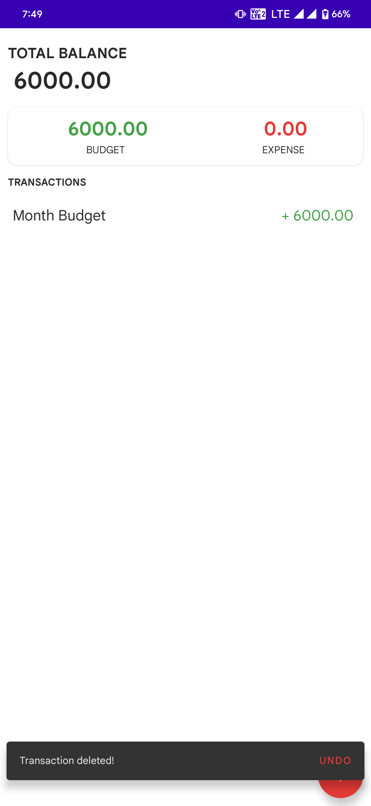

# Expense Mate Android-App

n today's fast-paced world, managing personal finances is more important than ever, and this app aims to make it simpler and more convenient. With a user-friendly interface and intuitive features, it empowers users to track their expenses on the go, gain valuable insights, and take control of their financial well-being.

📈 Key Features:
✅ Simple and Intuitive Design: The app's sleek design and clean interface ensure a seamless user experience, making it easy to navigate and understand.
✅ Expense Tracking: Users can effortlessly record their expenses, categorize them, and add detailed notes for better organization.
✅ Budget Management: The app allows users to set monthly budgets, track their spending against those budgets, and receive notifications when they exceed preset limits.

| Icon    | Splash Screen |
| -------- | ------- |
|||
| Login & Signup page  | Main Screen |
|||
| Add transaction    | After adding transaction |
|||
| Updating Transaction    | Swipe to Delete |
|||
